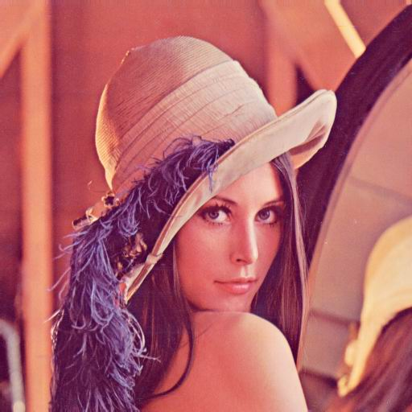

# 📸Imagio

<a href="https://github.com/Oskarowski/imagio-image-processing-app"></a>
 [](https://go.dev/doc/install) [](https://github.com/Oskarowski/imagio-image-processing-app/releases)

---

## 📝Table of Content

### 💡Overview

Imagio is a Go-based image processing application that supports two modes:

-   **CLI Mode**: Run commands directly from the terminal.
-   **TUI Mode**: An interactive text–user interface (TUI) for exploring and applying commands.

### 📜Available commends:

| Available Commands            | Description                                                                                                                                                                                                                                                                                                                                                                    |
| ----------------------------- | ------------------------------------------------------------------------------------------------------------------------------------------------------------------------------------------------------------------------------------------------------------------------------------------------------------------------------------------------------------------------------ |
| Change img brightness         | Adjust brightness of the image by given percentage.                                                                                                                                                                                                                                                                                                                            |
| Adjust img contrast           | Adjust contrast of the image by given value.                                                                                                                                                                                                                                                                                                                                   |
| Get negative img              | Apply negative transformation to the image.                                                                                                                                                                                                                                                                                                                                    |
| Flip img horizontally         | Flip the image horizontally.                                                                                                                                                                                                                                                                                                                                                   |
| Flip img vertically           | Flip the image vertically.                                                                                                                                                                                                                                                                                                                                                     |
| Flip img diagonally           | Flip the image diagonally.                                                                                                                                                                                                                                                                                                                                                     |
| Shrink img                    | Shrink the image by given factor.                                                                                                                                                                                                                                                                                                                                              |
| Enlarge img                   | Enlarge the image by given factor.                                                                                                                                                                                                                                                                                                                                             |
| Adaptive denoising filter     | Apply adaptive median noise removal filter to the image.                                                                                                                                                                                                                                                                                                                       |
| Min denoising filter          | Apply min noise removal filter to the image.                                                                                                                                                                                                                                                                                                                                   |
| Max denoising filter          | Apply max noise removal filter to the image.                                                                                                                                                                                                                                                                                                                                   |
| Img comparison commands       | Compare the image with another image: <br> - Mean Square Error (mse) <br> - Peak Mean Square Error (pmse) <br> - Signal to Noise Ratio (snr) <br> - Peak Signal to Noise Ratio (psnr) <br> - Max Difference (md)                                                                                                                                                               |
| Generate img histogram        | Generate and save a graphical representation of the histogram of the image.                                                                                                                                                                                                                                                                                                    |
| Img histogram characteristics | Calculate image characteristics based on its histogram: <br> - Mean intensity (cmean) <br> - Variance intensity (cvariance) <br> - Standard deviation (cstdev) <br> - Coefficient of variation (Type I) (cvarcoi) <br> - Asymmetry coefficient (casyco) <br> - Flattening coefficient (cflatco) <br> - Coefficient of variation (Type II) (cvarcoii) <br> - Entropy (centropy) |
| Rayleigh transform            | Apply Rayleigh transform to the image.                                                                                                                                                                                                                                                                                                                                         |
| Edge sharpening               | Apply selected edge sharpening mask to the image.                                                                                                                                                                                                                                                                                                                              |
| Kirsh edge detection          | Apply Kirsh edge detection to the image.                                                                                                                                                                                                                                                                                                                                       |
| Img dilation                  | Apply dilation operation using the chosen structural element.                                                                                                                                                                                                                                                                                                                  |
| Img erosion                   | Apply erosion operation using the chosen structural element.                                                                                                                                                                                                                                                                                                                   |
| Img opening                   | Apply opening operation using the chosen structural element.                                                                                                                                                                                                                                                                                                                   |
| Img closing                   | Apply closing operation using the chosen structural element.                                                                                                                                                                                                                                                                                                                   |
| Hit or miss                   | Apply hit-or-miss operations with 2 chosen structural elements.                                                                                                                                                                                                                                                                                                                |
| Img thinning                  | Apply thinning aka skeletonization operation to the image.                                                                                                                                                                                                                                                                                                                     |
| Region growing                | Perform region growing segmentation on the image.                                                                                                                                                                                                                                                                                                                              |
| Bandpass filter               | Apply bandpass filtering to the image.                                                                                                                                                                                                                                                                                                                                         |
| Lowpass filter                | Apply lowpass filtering to the image.                                                                                                                                                                                                                                                                                                                                          |
| Highpass filter               | Apply highpass filtering to the image.                                                                                                                                                                                                                                                                                                                                         |
| Bandcut filter                | Apply bandcut filtering to the image.                                                                                                                                                                                                                                                                                                                                          |
| Img phase modification        | Modify the image phase.                                                                                                                                                                                                                                                                                                                                                        |
| Maskpass filter               | Apply mask-based filtering.                                                                                                                                                                                                                                                                                                                                                    |

### CLI Usage & Examples

```bash
Usage: ./imagio <command> [-argument=value [...]] <bmp_image_path> [<second_image_path>]
```

<details>

<summary><strong><i>./imagio --help</i></strong></summary>

```text
Available commands:
 --brightness -value=50 <bmp_image_path>
   Description: Adjust brightness of the image.
   Arguments:
    -value=(int): Brightness percentage adjustment value.

 --contrast -value=25 <bmp_image_path>
   Description: Adjust contrast of the image.
   Arguments:
    -value=(int): Contrast adjustment value (-255 to 255).

 --negative <bmp_image_path>
   Description: Create a negative of the image.

 --hflip <bmp_image_path>
   Description: Flip the image horizontally.

 --vflip <bmp_image_path>
   Description: Flip the image vertically.

 --dflip <bmp_image_path>
   Description: Flip the image diagonally.

 --shrink -value=2 <bmp_image_path>
   Description: Shrink the image by a factor.
   Arguments:
    -value=(int): Shrink factor.

 --enlarge -value=2 <bmp_image_path>
   Description: Enlarge the image by a factor.
   Arguments:
    -value=(int): Enlarge factor.

 --adaptive <bmp_image_path>
   Description: Apply adaptive median noise removal filter to the image.
   Arguments:
    -min=(int): Minimal size of window size for filter defaults, to 3.
    -max=(int): Maximal size of window size for filter defaults, to 7.

 --min -value=3 <bmp_image_path>
   Description: Apply min noise removal filter.
   Arguments:
    -value=(int): Window size.

 --max -value=3 <bmp_image_path>
   Description: Apply max noise removal filter.
   Arguments:
    -value=(int): Window size.

 --mse <comparison_image_path> <bmp_image_path>
   Description: Calculate Mean Square Error with a comparison image.

 --pmse <comparison_image_path> <bmp_image_path>
   Description: Calculate Peak Mean Square Error with a comparison image.

 --snr <comparison_image_path> <bmp_image_path>
   Description: Calculate Signal to Noise Ratio with a comparison image.

 --psnr <comparison_image_path> <bmp_image_path>
   Description: Calculate Peak Signal to Noise Ratio with a comparison image.

 --md <comparison_image_path> <bmp_image_path>
   Description: Calculate Max Difference with a comparison image.

 --histogram <bmp_image_path>
   Description: Generate and save a graphical representation of the histogram of the image.

 --hrayleigh -min=0 -max=255 -alpha="0.2" <bmp_image_path>
   Description: Apply Rayleigh transformation to the image.
   Arguments:
    -min=(int): Minimum value in the range [0, 255].
    -max=(int): Maximum value in the range [0, 255], must be greater than min.
    -alpha=(float): Alpha value for transformation. Note: Quote float values (e.g., -alpha="0.5").

 --cmean <bmp_image_path>
   Description: Calculate the mean intensity from the histogram of the image.

 --cvariance <bmp_image_path>
   Description: Calculate the variance intensity from the histogram of the image.

 --cstdev <bmp_image_path>
   Description: Calculate the standard deviation from the histogram of the image.

 --cvarcoi <bmp_image_path>
   Description: Calculate the coefficient of variation (type I) from the histogram.

 --casyco <bmp_image_path>
   Description: Calculate the asymmetry coefficient from the histogram.

 --cflatco <bmp_image_path>
   Description: Calculate the flattening coefficient from the histogram.

 --cvarcoii <bmp_image_path>
   Description: Calculate the coefficient of variation (type II) from the histogram.

 --centropy <bmp_image_path>
   Description: Calculate the entropy from the histogram of the image.

 --sedgesharp -mask="edge1" <bmp_image_path>
   Description: Apply edge sharpening with the specified mask.
   Arguments:
    -mask=(string): The name of the mask to use.

 --okirsf <bmp_image_path>
   Description: Apply Kirsch edge detection to the image.

 --dilation -se=<structuring_element> <bmp_image_path>
   Description: Apply dilation operation using the specified structuring element.
   Arguments:
    -se=(string): Name of SE based on structure_elements.json.

 --erosion -se=<structuring_element> <bmp_image_path>
   Description: Apply erosion operation using the specified structuring element.
   Arguments:
    -se=(string): Name of SE based on structure_elements.json.

 --opening -se=<structuring_element> <bmp_image_path>
   Description: Apply opening operation using the specified structuring element.
   Arguments:
    -se=(string): Name of SE based on structure_elements.json.

 --closing -se=<structuring_element> <bmp_image_path>
   Description: Apply closing operation using the specified structuring element.
   Arguments:
    -se=(string): Name of SE based on structure_elements.json.

 --hmt -se1=<foreground_se> -se2=<background_se> <bmp_image_path>
   Description: Perform hit-or-miss transformation using foreground and background structuring elements.
   Arguments:
    -se1=(string): Path to or inline definition of the foreground structuring element.
    -se2=(string): Path to or inline definition of the background structuring element.

 --thinning <bmp_image_path>
   Description: Apply thinning operation to the image.

 --region-grow -seeds=<seeds> -metric=<metric> -threshold=<value> <bmp_image_path>
   Description: Perform region growing segmentation on the image.
   Arguments:
    -seeds=(string): List of seed points as [x,y][x,y][x,y].
    -metric=(int): Distance metric ('0 - Euclidean', '1 - Manhattan', '2 - Chebyshev').
    -threshold=(double): Similarity threshold for region growing.

 --bandpass -low=15 -high=50 -spectrum=1 <bmp_image_path>
   Description: Apply bandpass filtering to the image.
   Arguments:
    -low=(int): Lower cutoff frequency.
    -high=(int): Upper cutoff frequency.
    -spectrum=(int): Include spectrum in output (0 or 1).

 --lowpass -cutoff=15 -spectrum=1 <bmp_image_path>
   Description: Apply lowpass filtering to the image.
   Arguments:
    -cutoff=(int): Cutoff frequency.
    -spectrum=(int): Include spectrum in output (0 or 1).

 --highpass -cutoff=25 -spectrum=1 <bmp_image_path>
   Description: Apply highpass filtering to the image.
   Arguments:
    -cutoff=(int): Cutoff frequency.
    -spectrum=(int): Include spectrum in output (0 or 1).

 --bandcut -low=25 -high=70 -spectrum=1 <bmp_image_path>
   Description: Apply bandcut filtering to the image.
   Arguments:
    -low=(int): Lower cutoff frequency.
    -high=(int): Upper cutoff frequency.
    -spectrum=(int): Include spectrum in output (0 or 1).

 --phasemod -k=123 -l=123 <bmp_image_path>
   Description: Modify the image phase.
   Arguments:
    -k=(int): Phase modulation parameter k.
    -l=(int): Phase modulation parameter l.

 --maskpass -spectrum=0 -mask="F5mask1.bmp" <bmp_image_path>
   Description: Apply mask-based filtering using a specified mask.
   Arguments:
    -spectrum=(int): Include spectrum in output (0 or 1).
    -mask=(string): Name of the mask image (relative to orthogonal_transforms/masks).

 --help
   Description: Show this help message.
```

</details>

<details>
  <summary><strong>Change Image Brightness</strong></summary>

Console input:

```bash
./imagio --brightness -value=-50 .\imgs\lenac.bmp
```

Console output:

```bash
Image saved successfully as: lenac_altered_brightness.bmp
Execution Report:
Command: brightness
Description: Brightness adjusted by -50
Duration: 12.9026ms

Total operation time: 12.9026ms
```

| Original              | Altered                                                 |
| --------------------- | ------------------------------------------------------- |
|  |  |

Console input:

```bash
./imagio --brightness -value=50 .\imgs\lenac.bmp
```

Console output:

```bash
Image saved successfully as: lenac_altered_brightness.bmp
Execution Report:
Command: brightness
Description: Brightness adjusted by 50
Duration: 12.4392ms

Total operation time: 12.4392ms
```

| Original              | Altered                                                    |
| --------------------- | ---------------------------------------------------------- |
|  |  |

</details>

<details>
<summary><strong>Get negative img</strong></summary>

Console input:

```bash
./imagio --negative .\imgs\lenac.bmp
```

Console output:

```bash
Image saved successfully as: lenac_negative.bmp
Execution Report:
Command: negative
Description: Negative image created
Duration: 11.0808ms

Total operation time: 11.0808ms
```

| Original              | Altered                                                 |
| --------------------- | ------------------------------------------------------- |
|  |  |

</details>

<details>
<summary><strong>Shrink img</strong></summary>

Console input:

```bash
./imagio --shrink -value=4 .\imgs\lenac.bmp
```

Console output:

```bash
Image saved successfully as: lenac_shrunk_by_4x.bmp
Execution Report:
Command: shrink
Description: Image shrunk by a factor of 4
Duration: 0s

Total operation time: 0s
```

| Original              | Altered                                                 |
| --------------------- | ------------------------------------------------------- |
|  |  |

</details>

<details>
<summary><strong>Adaptive denoising filter</strong></summary>

Console input:

```bash
./imagio --adaptive -min=5 -max=7 .\imgs\impulse_noise\lena_impulse3.bmp
```

Console output:

```bash
Image saved successfully as: lena_impulse3_adaptive_median_filter.bmp
Execution Report:
Command: adaptive
Description: Adaptive median filter applied
Duration: 1.0786711s

Total operation time: 1.0786711s
```

| Original              | Altered                                                 |
| --------------------- | ------------------------------------------------------- |
|  |  |

</details>

<details>
<summary><strong>Img comparison commands</strong></summary>

Console input:

```bash
./imagio --mse --pmse --snr --psnr --md .\imgs\lenag.bmp .\output\lena_impulse3_adaptive_median_filter.bmp
```

Console output:

```bash
Execution Report:
Command: mse
Description: Mean Square Error calculated
Result: MSE: 8.242210
Duration: 6.9975ms

Command: pmse
Description: Peak Mean Square Error calculated
Result: PMSE: 0.000148
Duration: 13.6692ms

Command: snr
Description: Signal to Noise Ratio calculated
Result: SNR: 33.285188
Duration: 25.5451ms

Command: psnr
Description: Peak Signal to Noise Ratio calculated
Result: PSNR: 38.297803
Duration: 14.6041ms

Command: md
Description: Max Difference calculated
Result: Max Difference: 203
Duration: 6.8289ms

Total operation time: 67.6448ms
```

</details>

<details>
<summary><strong>Generate img histogram</strong></summary>

Console input:

```bash
./imagio --histogram .\imgs\lenac.bmp
```

Console output:

```bash
Image saved successfully as: lenac_histogram.bmp
Execution Report:
Command: histogram
Description: Computed Graphical Representation of Histogram
Duration: 11.8931ms

Total operation time: 11.8931ms
```

| Source              | Result                                                 |
| --------------------- | ------------------------------------------------------- |
|  |  |

</details>

<details open>
<summary>Img histogram characteristics</summary>
World!
</details>

<details open>
<summary>Edge sharpening</summary>
World!
</details>

<details open>
<summary>Img thinning</summary>
World!
</details>

<details open>
<summary>Region growing</summary>
World!
</details>

<details open>
<summary>Bandpass filter</summary>
World!
</details>

---

### TUI Usage & Examples

```bash
Usage: ./imagio
```

<details>
  <summary><i>After entering ./imagio</i></summary>


</details>

<details open>
  <summary>Change img brightness</summary>
  World!
</details>

<details open>
  <summary>Get negative img</summary>
  World!
</details>

<details open>
  <summary>Enlarge img</summary>
  World!
</details>

<details open>
  <summary>Adaptive denoising filter</summary>
  World!
</details>

<details open>
  <summary>Img comparison commands</summary>
  World!
</details>

<details open>
  <summary>Generate img histogram</summary>
  World!
</details>

<details open>
  <summary>Img histogram characteristics</summary>
  World!
</details>

<details open>
  <summary>Edge sharpening</summary>
  World!
</details>

<details open>
  <summary>Img thinning</summary>
  World!
</details>

<details open>
  <summary>Region growing</summary>
  World!
</details>

<details open>
  <summary>Bandpass filter</summary>
  World!
</details>
